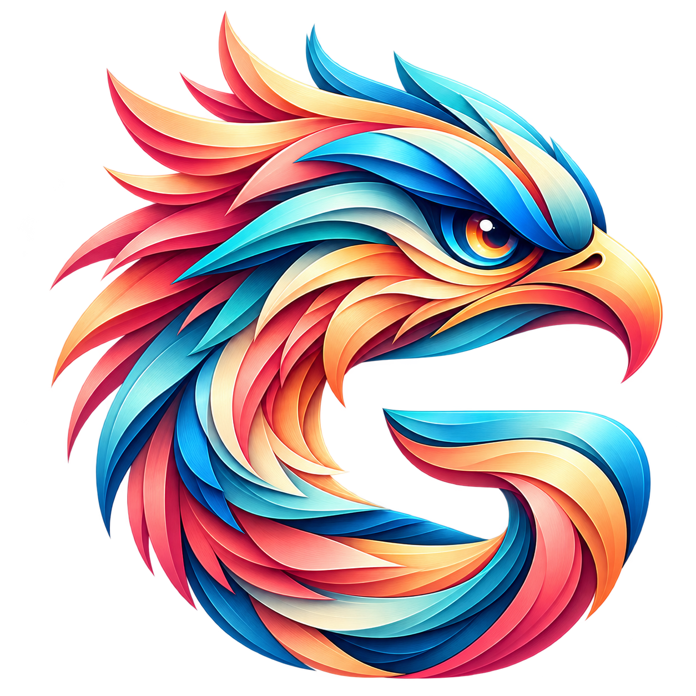
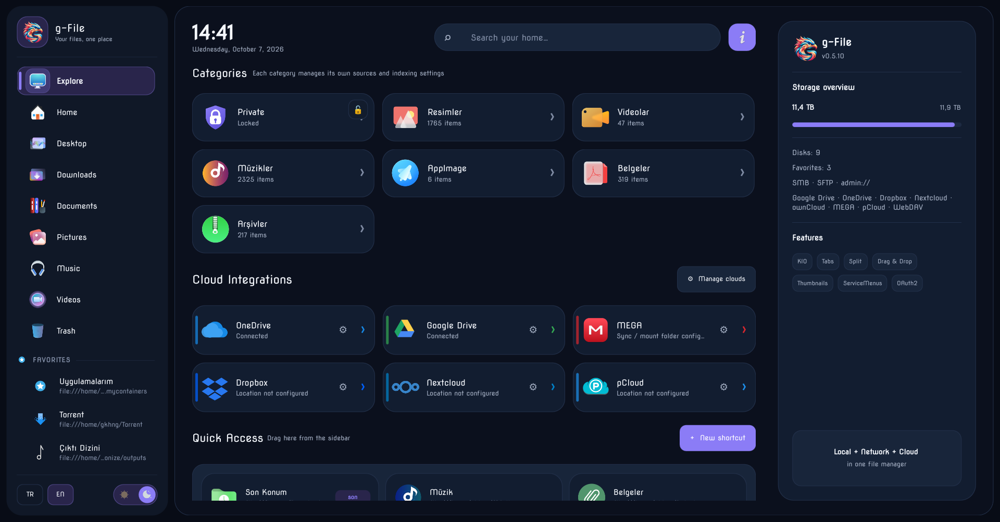
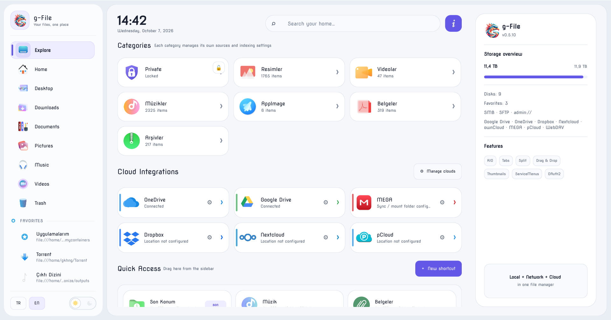

<p align="center">
  
</p>

<h1 align="center">g-File</h1>
<p align="center">Your files, media and cloud storage in one Linux desktop app.</p>
<p align="center">
  <a href="https://github.com/G-grbz/g-File/actions/workflows/ci.yml"></a>
  <a href="https://github.com/G-grbz/g-File/actions/workflows/codeql.yml"></a>
  <a href="LICENSE"></a>
</p>
<p align="center"><a href="#build-and-install">Build & install</a> · <a href="#distribution-support">Distribution support</a> · <a href="CONTRIBUTING.md">Contribute</a></p>

g-File is a Qt Quick file manager built on Qt 6 and KDE Frameworks 6. It combines everyday file operations with an Explore dashboard, indexed media libraries and built-in image, video and music players.

**Current source version: 0.5.52.** This is an actively developed Linux desktop application. The repository provides source builds; it does not currently ship an official AppImage or Flatpak.

## Screenshots

### Dark theme



### Light theme



The screenshots show the current application with a locally selected icon theme. System icons follow your installed theme; bundled icons are also available.

## Features

- **File management:** tabs, split panes, editable breadcrumbs, recursive search, favorites, drag and drop, inline/batch rename, undo and familiar keyboard shortcuts.
- **Desktop integration:** KDE KIO transfers, selectable in-app progress, system icon themes, trash, network locations and `org.freedesktop.FileManager1` support for “Show in folder”. Files open through their MIME default applications.
- **Explore:** configurable category shortcuts, filtered home indexing, media roots, date-grouped photo/video libraries, quick access and disk capacity indicators.
- **Media:** cached previews, photo viewing, video playback with subtitles, a music player and DLNA browsing/playback. Supported codecs depend on the installed Qt Multimedia backend.
- **Subtitles:** optional local AI translation and Whisper transcription, live translated cues and readable timing-aware splitting.
- **Cloud:** Google Drive and OneDrive sign-in, browsing and transfers, including context-menu uploads when connected. OAuth application credentials are configured by the user.
- **Appearance:** light/dark application themes, adjustable icons, wheel-scroll speed and persisted window/view preferences. The video player keeps its dark presentation.

## Distribution support

**Primary target: Linux with KDE Plasma.** Development and desktop testing have been performed on **Manjaro Linux, x86_64, KDE Plasma/Wayland, Qt 6.11.2**. X11 launch profiles are available but do not imply equivalent testing on every graphics stack.

The current build requires **Qt ≥ 6.9**, **OpenSSL ≥ 3.2**, **KDE Frameworks 6**, **CMake ≥ 3.21** and a **C++17 compiler**. Merely installing a package called “Qt 6” is not sufficient.

| Distribution | Current status |
| --- | --- |
| Manjaro Linux, updated rolling installation | Tested development environment; recommended with KDE Plasma. |
| Arch Linux / EndeavourOS, fully updated | Appropriate dependency baseline; Arch Linux is the CI build target. Desktop behavior still needs testing on your installation. |
| Fedora KDE 43 / 44 | Qt package versions meet the minimum; source builds are expected when all listed KDE/OpenSSL development dependencies are installed. Not desktop-tested by this project. |
| openSUSE Tumbleweed | Candidate for source builds if the installed Qt/OpenSSL/KF6 packages meet the requirements; not yet verified by this project. |
| Debian 13 (trixie) | Stock Qt 6.8 does **not** meet the Qt 6.9 requirement. A newer complete Qt/KF6 stack is required. |
| Ubuntu 24.04 LTS / Linux Mint 22 | Stock Qt 6.4 does **not** meet the minimum. A source build against the stock packages is unsupported. |
| Other/newer Linux distributions | Check the complete dependency versions before building; no blanket compatibility claim. |
| Windows / macOS | Not supported by this project. |

Package references: [Arch Qt](https://archlinux.org/packages/extra/x86_64/qt6-declarative/), [Fedora Qt](https://packages.fedoraproject.org/pkgs/qt6-qtdeclarative/qt6-qtdeclarative/index.html), [Debian stable Qt](https://packages.debian.org/stable/qt6-declarative-dev), [Ubuntu 24.04 Qt](https://packages.ubuntu.com/zh-cn/noble/qt6-declarative-dev). Distribution packages change; CMake checks your installed versions at configuration time.

On another Linux desktop, KDE libraries, KIO workers, D-Bus, a wallet service and any required authentication agents must still be installed. Integration may differ from Plasma. Only x86_64 has been tested; other architectures are unverified.

## Build and install

### 1. Install dependencies

**Arch Linux / Manjaro / EndeavourOS**

Keep a rolling installation fully updated:

```bash
sudo pacman -Syu --needed \
  base-devel git cmake ninja extra-cmake-modules \
  qt6-base qt6-declarative qt6-multimedia qt6-networkauth qt6-svg qt6-wayland \
  kio kservice kwallet kiconthemes karchive kwindowsystem openssl
```

Useful runtime helpers:

```bash
sudo pacman -S --needed \
  ffmpeg ffmpegthumbnailer poppler 7zip libarchive squashfs-tools \
  mkvtoolnix-cli qt6-imageformats breeze-icons desktop-file-utils python
```

**Other distributions**

Install the development packages providing the following CMake targets/modules. Names vary between distributions; check versions first.

| Dependency | Required components |
| --- | --- |
| Qt 6.9+ | Quick, QuickControls2, Network, NetworkAuth, Concurrent, Widgets, DBus, Multimedia |
| KDE Frameworks 6 | KIO, Service, Wallet, IconThemes, Archive, WindowSystem; Extra CMake Modules |
| OpenSSL 3.2+ | Crypto development library |
| Toolchain | CMake 3.21+, Ninja or Make, C++17 compiler |
| Runtime | Qt SVG image plugin; Qt Wayland plugin for Wayland sessions; session D-Bus |

For optional previews and archive operations, install the tools in the table below. No Docker installation is required to build or run g-File; the CI uses disposable Arch Linux containers.

### 2. Compile

```bash
git clone https://github.com/G-grbz/g-File.git
cd g-File
cmake -S . -B build -G Ninja -DCMAKE_BUILD_TYPE=Release
cmake --build build --parallel 4
```

Use fewer build workers on memory-constrained machines. To try the application before installation:

```bash
./build/g-file
./build/g-file "$HOME/Downloads"
```

### 3. Install for your user

```bash
cmake --install build --prefix "$HOME/.local"
update-desktop-database "$HOME/.local/share/applications"
```

Ensure **`$HOME/.local/bin` is in your desktop session's `PATH`**, then restart the session if you changed it. This matters for the desktop launcher and D-Bus activation as well as the terminal command.

Alternatively, install system-wide:

```bash
sudo cmake --install build --prefix /usr/local
```

### 4. Set as your folder manager (optional)

```bash
xdg-mime default g-file.desktop inode/directory
xdg-mime default g-file.desktop x-scheme-handler/trash
```

In Plasma, also select g-File under **System Settings → Default Applications → File Manager**. The installation includes the dock icon, desktop entry and FileManager1 D-Bus service. “Show in folder” can reveal/select a file when the calling app sends a `ShowItems` request; a request containing only a directory cannot identify an individual downloaded file.

### Launch profiles

The default launcher inherits your desktop environment. Configure a different profile only if needed:

```bash
cmake -S . -B build -DGFILE_LAUNCH_PROFILE=wayland
cmake --build build --parallel 4
cmake --install build --prefix "$HOME/.local"
```

Available profiles: `default`, `wayland`, `wayland-opengl`, `x11`, `x11-opengl`, `nvidia`, `nvidia-x11`, `custom`. The `custom` profile also requires `GFILE_CUSTOM_EXEC`.

## Optional integrations

| Capability | Helper/configuration |
| --- | --- |
| Video duration/FPS, thumbnails, subtitle extraction | `ffmpeg`, `ffprobe`, `ffmpegthumbnailer` |
| Embedded Matroska cover artwork | `mkvmerge`, `mkvextract` from MKVToolNix |
| PDF previews | `pdftoppm` from Poppler |
| Archive creation / extraction | `bsdtar` from libarchive / `7z` from 7zip; format support depends on the helper |
| AppImage icon extraction | `unsquashfs` from squashfs-tools |
| Additional image formats | Qt image-format plugins |
| Administrator locations | `kio-admin` and a functioning Polkit agent |
| Terminal, external search, disk usage | Your configured terminal; optional `kfind`, `filelight` |
| Device/Bluetooth sending | Optional KDE Connect/Bluetooth tools |
| Film metadata | A user-provided TMDB read-access token in settings or `TMDB_API_TOKEN` |

### Cloud accounts

Configure a Google desktop OAuth client or a Microsoft public-client application in the cloud settings, then connect your account. Environment defaults are also supported: `GFILE_GOOGLE_CLIENT_ID`, `GFILE_GOOGLE_CLIENT_SECRET`, `GFILE_ONEDRIVE_CLIENT_ID` and `GFILE_ONEDRIVE_TENANT`. Tokens/secrets are handled through KWallet. No shared OAuth or TMDB credentials are included in this repository.

### Local AI subtitles

AI features are optional and do not affect basic file browsing. Python, the relevant inference packages, downloaded models and adequate RAM/disk space are needed. The bundled worker can provision dependencies when an AI task is requested; first use can require network access. Existing subtitle translation does not load Whisper unless audio transcription is requested.

See [tools/subtitle-ai/README.md](tools/subtitle-ai/README.md), [runtime requirements](tools/subtitle-ai/requirements.txt) and [translation-only requirements](tools/subtitle-ai/requirements-translation.txt). Model licenses are separate from the application license. NVIDIA acceleration requires the compatible CUDA/cuDNN runtime; CPU execution is also supported.

## Keyboard shortcuts

| Shortcut | Action |
| --- | --- |
| `Ctrl+C` / `Ctrl+X` / `Ctrl+V` | Copy / cut / paste |
| `Ctrl+Z` / `Ctrl+D` | Undo / duplicate |
| `F2` | Rename selection; batch rename for multiple items |
| `Delete` / `Shift+Delete` | Move to trash / permanently delete |
| `Ctrl+F` / `Ctrl+L` | Search / edit location |
| `Ctrl+H` / `F5` | Toggle hidden files / refresh |
| `Ctrl+T` / `Ctrl+W` / `Ctrl+Shift+T` | New tab / close tab / reopen closed tab |
| `Alt+Left` / `Alt+Right` / `Alt+Up` | Back / forward / parent directory |
| `Ctrl+Shift+N` / `Ctrl+N` | New folder / new file |
| `Shift+F4` | Open terminal here |
| `F3` | Toggle split view |
| `Ctrl+1` / `Ctrl+2` | Grid / list |
| `Ctrl++` / `Ctrl+-` / `Ctrl+0` | Increase / decrease / reset icons |
| `Alt+Enter` | Properties |

## Development and checks

```bash
bash .github/scripts/run-headless-tests.sh
```

The **Build and tests** workflow compiles and checks installation on Arch Linux, then runs the Python, QML and system-icon regression tests. The **CodeQL** workflow performs C++ analysis with a manual full build, plus Python and GitHub Actions analysis, on pushes/PRs and weekly. See [tests/README.md](tests/README.md) for native integration harnesses and [CONTRIBUTING.md](CONTRIBUTING.md) for contribution guidance.

| Directory | Contents |
| --- | --- |
| `src/` | Native models, file operations, desktop/cloud/media integration |
| `qml/` | Application UI and shared controls |
| `assets/` | Bundled icons and branding |
| `tools/` | Subtitle workers and user-data migration tool |
| `packaging/` | Desktop entry template and D-Bus activation service |
| `tests/` | Python, QML and native regression harnesses |

The application keeps persistent data under the canonical `g-File` user data directory (normally `~/.local/share/g-File`). Configuration/cache locations also follow their Qt/XDG settings. Local settings, indexes, downloaded models, build outputs and credentials are not part of the source repository.

## License

The original g-File application source is licensed under **GNU GPL v3 or any later version** (`GPL-3.0-or-later`); see [LICENSE](LICENSE). Bundled tools retain their own existing notices. Third-party artwork, trademarks, libraries and downloaded models are subject to their respective terms; see [THIRD_PARTY.md](THIRD_PARTY.md).
